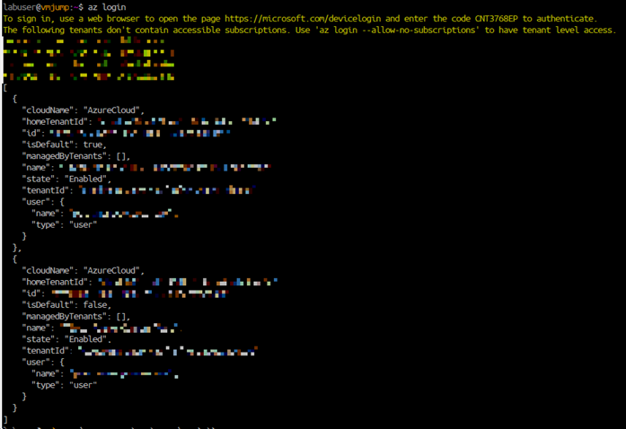
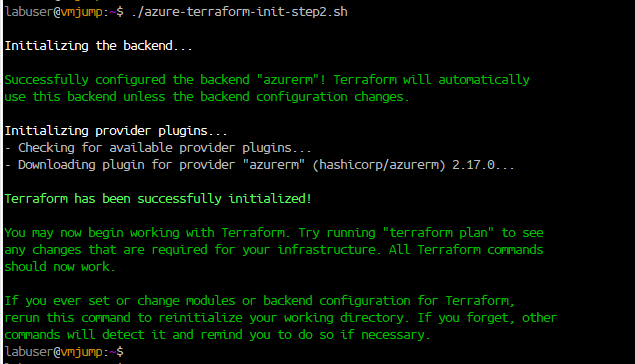
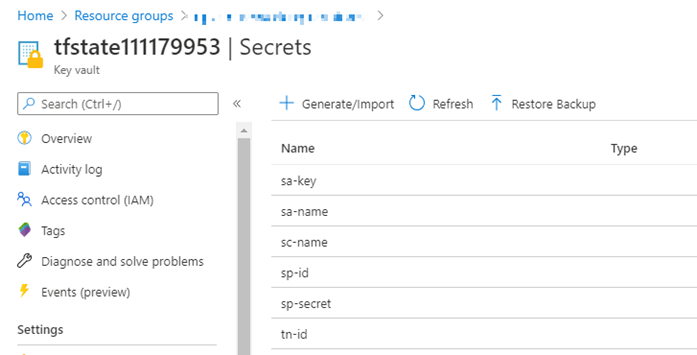

# Scaffold a production-ready Terraform project

Here're two simple bash scripts to ease terraform project scaffolding on Azure. 
It allows you to share tfstate file with other developers from your team while all secrets and IDs are securely stored in Azure vault.
It's a modified version of the scrips described in the article [Using Terraform with Azure — the right way](https://medium.com/01001101/using-terraform-with-azure-the-right-way-35af3b51a6b0) with one difference that the service principal (SP) account already exists. This has been created for the environment with a limited permissions where a new SP account can't be created.
The scripts create a new storage blob in Azure to store tfstate file and also Azure keyvault to store credentials that are used by terraform. The credentials are retrieved into environmental variables and used by terraform when it's being initiated.


## How to use the script

* Clone or download the repository

* Navigate to the directory containg scripts and make the scripts executable
```shell
chmod +x azure-terraform-init-step1.sh
chmod +x azure-terraform-init-step2.sh
```

* Login to Azure in azure cli



* Export the location and the resource group name where the vault and blob storage is to be deployed into environmental variables. Also the subscription ID needs to be exported to the environmental variable to get these resources created. And the last item to be exported is the service principal account ID that will be used by terraform to deploy resources in your projects.    

```shell
# Specify subscription
export subscriptionId="xxxxxxxx-xxxx-xxxx-xxxx-xxxxxxxxxxxx"
# Specify the resource group
export rg="my-resource-group"
# Specify the location
export location="West Europe"
# Specify an existing service principal name
export spName="yyyyyyyy-yyyy-yyyy-yyyy-yyyyyyyyyyyy"
```
* Execute the scripts one after another

```shell
./azure-terraform-init-step1.sh
./azure-terraform-init-step2.sh
```

Terraform gets initiated with the backend configuration using the blob storage for tfstate file.
<br>

<br>
All secrets are stored in the vault.<br>
<br>

<br>
Continue with defining Azure resources from your project in *.tf file to be deployed in the cloud infra.
For example, add the following resource into main.tf and deploy the resource group on Azure.

```shell
resource "azurerm_resource_group" "rg" {
    name            = "rg-scaffolded-project-demo"
    location        = "westeurope"

    tags = {
        environment = "Terraform Demo"
    }
}
```


