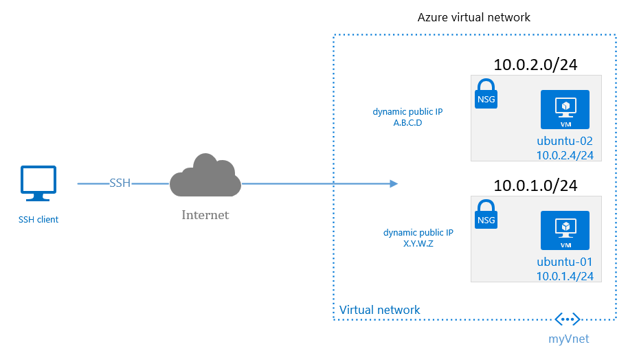

# Two Virtual Machines in one VNet

## Description
This is a very simple deployment which consists of two virtual machines placed in one VNet. Each virtual machine is connected to different subnet.

## Deployment through Terraform
Update the variables in the terraform_github.tfvars with valid credentials and rename the file to terraform.tfvars.

## Network Diagram


## Access to Virtual Machines
Virtual machines are accessible with public key authentication for user azureuser. Such a setup with exposing the public addresses to the internet is nor recommended though it maybe useful for testing scenarios i.e. for NSG etc. when virtual machines are not connected to on-premise through VPN or Express routes. 
The public key is stored as a variable pubkey defined in the [variables.tf](variables.tf).  

## Tips&Tricks
If the public IP addresses are not shown in the terraform output in the first go then try terraform refresh to have them displayed in teh CLI.
Example.
Outputs:

ubuntu_vm-01_public_ip = 51.137.207.184
ubuntu_vm-02_public_ip = 51.137.207.182


Ping from the ubuntu-vm-01 to ubuntu-vm-02
```shell
azureuser@ubuntu-vm-01:~⟫ ping 10.0.2.4
PING 10.0.2.4 (10.0.2.4) 56(84) bytes of data.
64 bytes from 10.0.2.4: icmp_seq=1 ttl=64 time=0.721 ms
64 bytes from 10.0.2.4: icmp_seq=2 ttl=64 time=0.816 ms
^C
--- 10.0.2.4 ping statistics ---
2 packets transmitted, 2 received, 0% packet loss, time 1001ms
rtt min/avg/max/mdev = 0.721/0.768/0.816/0.055 ms

```
