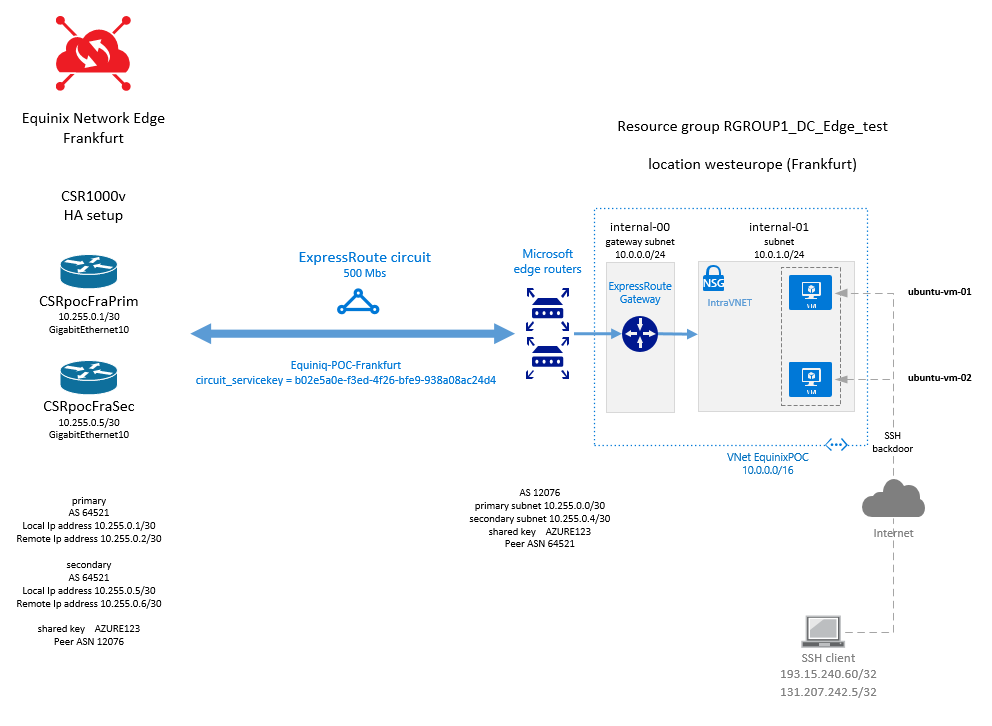
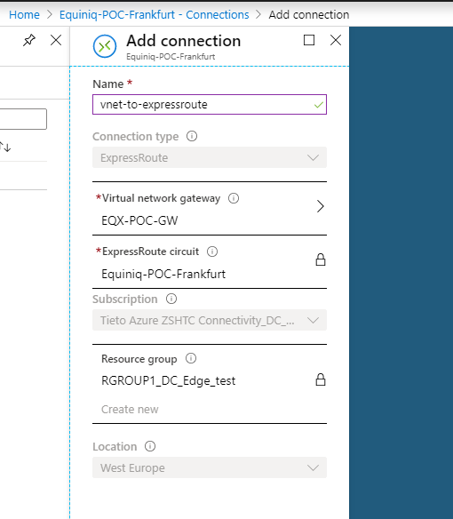

# One vNET with two VMs & Express Route to Equinix

## Description
The project was used for testing inter-cloud connectivity by using the product Network Edge from Equinix. 
The goal was to to establish private BGP peering between the Cisco CSR1000V routers running in Equinix and MS Azure.

## Deployment through Terraform
Update the variables in the terraform_github.tfvars with valid credentials and rename the file to terraform.tfvars.

## Network Diagram

## Access to Virtual Machines
Virtual machines are accessible with public key authentication for user azureuser. Such a setup with exposing the public addresses to the internet is nor recommended though it maybe useful for testing scenarios i.e. for NSG etc. when virtual machines are not connected to on-premise through VPN or Express routes. 
The public key is stored as a variable pubkey defined in the [variables.tf](variables.tf).  

## BGP parameters used in the setup

* Azure
    * AS 12076
    * Primary subnet 10.255.0.0/30
        * Local Ip address 10.255.0.2/30
        * Remote Ip address 10.255.0.1/30 
    * Secondary subnet 10.255.0.4/30
        * Local Ip address 10.255.0.6/30
        * Remote Ip address 10.255.0.5/30 
    * Shared key AZURE123
    * Peer ASN 64521

* Equinix
    * AS 64521
    * Primary subnet 10.255.0.0/30
        * Local Ip address 10.255.0.1/30
        * Remote Ip address 10.255.0.2/30
    * Secondary subnet 10.255.0.4/30
        * Local Ip address 10.255.0.5/30
        * Remote Ip address 10.255.0.6/30 
    * Shared key AZURE123
    * Peer ASN 12076
    
## Additional input variables
VLAN ID used on express circuits between Equinix and Azure. It matches the VLAN-IDs used by Cisco CSR1000v routers used as BGP neighbors in Equinix.  

## Output variables
The circuit ID identified by a service key (s-key) is displayed by terraform as the output variable to be used on the remote site in Equinix when defining the connection towards Azure. 

## Constraints & Additional information
* There's still one thing that is not not covered by Terraform yet and needs to be done manually - i.e. the connection between VNET and ExpressRoute. Follow the picture below to associate the VNET with Express route circuit.
 

 
More information can be found in the article [Connect a virtual network to an ExpressRoute circuit using the portal](https://docs.microsoft.com/en-us/azure/expressroute/expressroute-howto-linkvnet-portal-resource-manager).

* The custom UDR resource in the module expressroute_peering is not needed that's why it's commented out.

