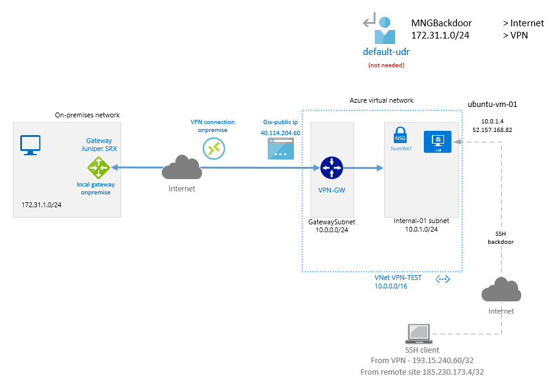

# VPN to on-premise

## Description
Simple VPN LAN-to-LAN connection without BGP routing between Azure and Juniper SRX as a customer gateway.

## Deployment through Terraform
Update the variables in the terraform_github.tfvars with valid credentials and rename the file to terraform.tfvars.
Note it takes ~45 minutes to deploy the VPN gateway.

## Network Diagram


## Access to Virtual Machines
Virtual machines are accessible with public key authentication for user azureuser and can be accessed directly through the Internet from specific addresses. Access is controlled by NSG rules.
Such a setup with exposing the public addresses to the internet is nor recommended though it maybe useful for testing scenarios i.e. for NSG etc. when virtual machines are not connected to on-premise through VPN or Express routes.
The public key is defined by the variable pubkey and is stored in the file [ide_rsa.pub](https://github.com/germanium-git/terraform_azure/blob/master/key/id_rsa.pub).

## Tips&Tricks
If the public IP addresses are not shown in the terraform output in the first go then try *terraform refresh* to have them displayed in the CLI.
Example.
```shell
Outputs:

vm-01-mac = 00-0D-3A-38-7D-09
vm-01-private-ip = 10.0.1.4
vm-01-public-ip = 13.69.74.68
```

The variables defining Address Space for Local Network Gateway in Terraform and also all routes in default-UDR are taken from the variable address_space.
```shell
# On-premisse CIDR
variable "address_space" {
  type = map(string)
  default = {
    subnet1 = "172.31.1.0/24"
    subnet2 = "172.31.2.0/24"
    subnet3 = "172.31.3.0/24"
  }
}
```


## Issues
It's not needed to associate the internal subnet with UDR, the connectivity between the on-site resources and virtual machines in the cloud works with and also without having the internal subnet associated with a the custom default-UDR. It's been tested by issuing ping requests from remote site to cloud while the internal subnet was being associated with default-UDR and no drops were observed.  
Despite creating a custom routing table Terraform doesn't associate it with any subnets. It can be further tested by creating and modifying associations and routes manually.