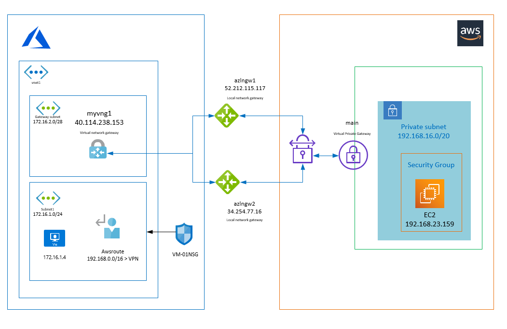

# Diagram

# Steps to reproduce

Note: It depends on the 00-scaffolding_script that must be executed first.

* As a very first step connect to Azure in PowerShell with your user account by issuing Connect-AzAccount command in power shell.

* Update variables in the power shell script set-azure_env-variables.ps1.

* Execute the script to retrieve environmental variables for Azure and secrets from vault. It also initializes the terraform and configures the terraform backend in Azure blob storage.

* Check the environmental variables by executing check-azure_env-variables.ps1 to ensure they do not contain leading or trailing quote characters.

* Update variables in the script set-aws_env-variables.ps1 and execute it to have the environmental variables updated to authenticate to AWS with terraform too.

* Deploy resources by terraform.

# Testing VMs
Virtual machines can be created from CLI to test connectivity between clouds.

## Create VM in Azure

* List subscriptions
az account list --output table

* Set active subscriptions
az account set --subscription "xxxxxxxxxxxxxxxx"

* Create VM in Azure
$USERNAME="myuser"
$PASSWORD="mypass123"
$RG="myrg"
$AZSUBNETNAME="subnet1"
$AZVNETNAME="vnet1"
$AZSUBNETID=(az network vnet subnet show --resource-group $RG --name $AZSUBNETNAME --vnet-name $AZVNETNAME --query id -o tsv)
az vm create --resource-group $RG --name "VM-01" --image "UbuntuLTS" --subnet $AZSUBNETID --admin-username $USERNAME --admin-password $PASSWORD

## Create VM in AWS

* Import key

aws ec2 import-key-pair --key-name "my-key" --region eu-west-1 --public-key-material fileb://D:\MEGA\Github\terraform_azure\key\id_rsa.pub

* Create instance

aws ec2 run-instances --image-id ami-03dee5f7855aa0974 --key-name my-key --instance-type t2.micro --region eu-west-1 --subnet-id subnet-0df56b2272323039b --count 1

Note don't forget to enable incoming traffic from Azure in the Security group associated with EC2 instance. 

## Cleanup 

* Delete VM in Azure
az vm delete --resource-group $RG --name "VM-01"

* Terminate VM in AWS
aws ec2 terminate-instances --instance-id i-0391ed33041ca76c1 --region eu-west-1

* terraform destroy