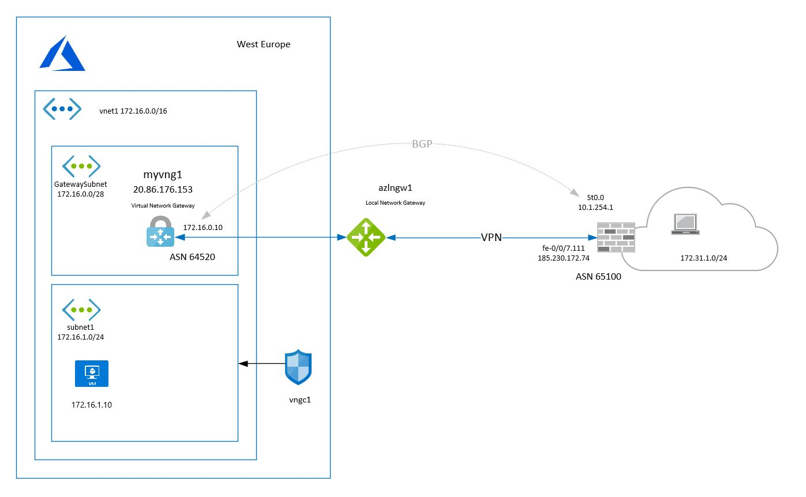

# VPN with BGP peering between Azure and Juniper SRX

## Description

The IPsec VPN with BGP routing between the on-premise firewall and virtual gateway. The gateway is running in active-active mode with only one peering address.  
There's one virtual machine running on vnet to demonstrate the connectivity between on-premise resources and Azure.<br>


## Steps to reproduce

- Create a copy of terraform.tfvars.gittemplate and name it terraform.tfvars
```
cp terraform.tfvars.gittemplate terraform.tfvars 
```
- **Make sure terraform.tfvars won't leak to git repository before filling in sensitive data**. Double check that terraform.tfvars is included in the gitignore file.
- Update sensitive variables in terraform.tfvars and other variables in variables.tf
- Login to az cli and set your default subscription to use for deployments 
```
az login
az account set --subscription "My Demos"
```
- Update credentials to authenticate to juniper SRX firewall. Public key authentication is used in the example.
- Deploy the resources through terraform.
```
terraform init
terraform apply
```
