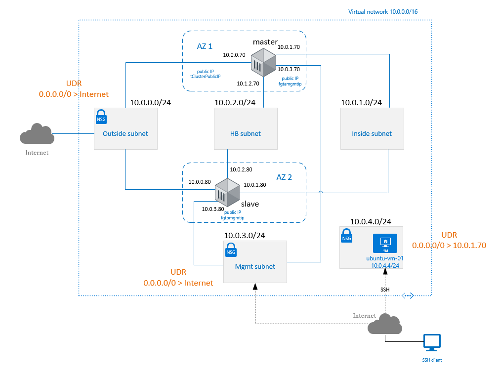

# Deploying and configuring active-passive HA between multiple zones
## Description
The scenario is composed of two FortiGate-VM forming an HA cluster located in different availability zones. It has been built based on the [FortiOS 6.2 Azure Cookbook](https://docs.fortinet.com/document/fortigate/6.2.0/azure-cookbook/227656/deploying-and-configuring-active-passive-ha-between-multiple-zones).

## Network Diagram


## Deployment through Terraform
Update the variables in the terraform_github.tfvars with valid credentials and rename the file to terraform.tfvars.


## Bootstrapping with using azureinit.conf
The configuration of virtual routers and license assignment and activation are done while the virtual machines boot up by specifying custom data to supply to the machine.
In thi case the data is stored in the file
```shell
    os_profile {
        computer_name  = "fg-master"
        admin_username = var.username
        admin_password = var.password
        custom_data    = file("./configs/azureinit-a.conf")
```
Make sure the file exist prior to applying terraform templates. The files in git repository do not contain licenses and their name ends with teh suffix *-git that needs to be removed.
Update the MIME text files named azureinit-a.conf and azureinit-b.conf with valid license keys.
You can download a sample azureinit.conf from [GitHub](https://raw.githubusercontent.com/fortinetsolutions/Azure-Templates/master/FortiGate/Others/Single-VM-BareMinimum-BYOL/azureinit.conf).


## SDN-Connector
Update connector config [sdn-connector-a.txt](configs/sdn-connector-a.txt) and [sdn-connector-b.txt](configs/sdn-connector-b.txt) with:
- valid interface names and IP configuration names that must match the names used by terraform templates - see the picture [IP_configuration_for_sdn-connector.PNG](documents/IP_configuration_for_sdn-connector.PNG).
- valid route name - see the [defaultroute_for_sdn-connector.PNG](documents/defaultroute_for_sdn-connector.PNG).
- and update also credentials to let virtual machines communicate with Azure API.
These two pieces of configuration have to be configured manually through CLI. It might have been put into the configuration applied as a part of bootstrapping process though.

## Access to the Virtual Machine
The testing virtual machine ubuntu-vm-01 is accessible with public key authentication for user azureuser from a specific IP addresses defined by combination of both the NSG rules and routing entry in the internal UDR defined by terraform variable mng_access_from. Such a setup with exposing the public addresses to the internet is nor recommended though it maybe useful for testing scenarios i.e. for NSG etc. when virtual machines are not connected to on-premise through VPN or Express routes.
The public key is stored in the file [ide_rsa.pub](https://github.com/germanium-git/terraform_azure/blob/master/key/id_rsa.pub).

## Issues
- It happens sometimes that FortiGate appliances can't get the license validated and hang up in validation stage. It helps when one of the nodes is rebooted.
- Though the initial config contains the configuration for firewall policy allowing all traffic to Internet it's not installed on the cluster.
