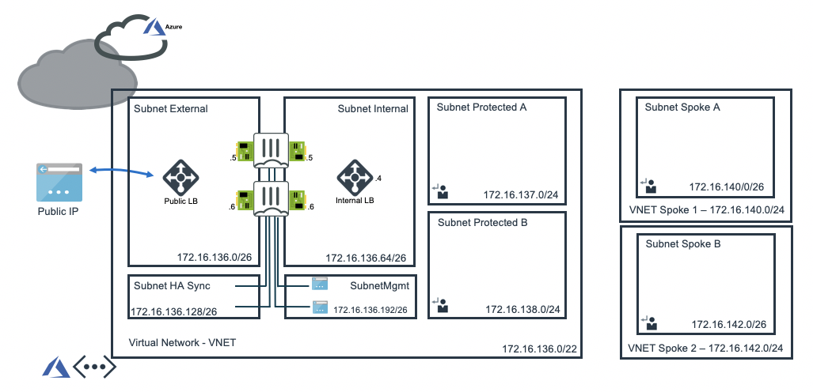
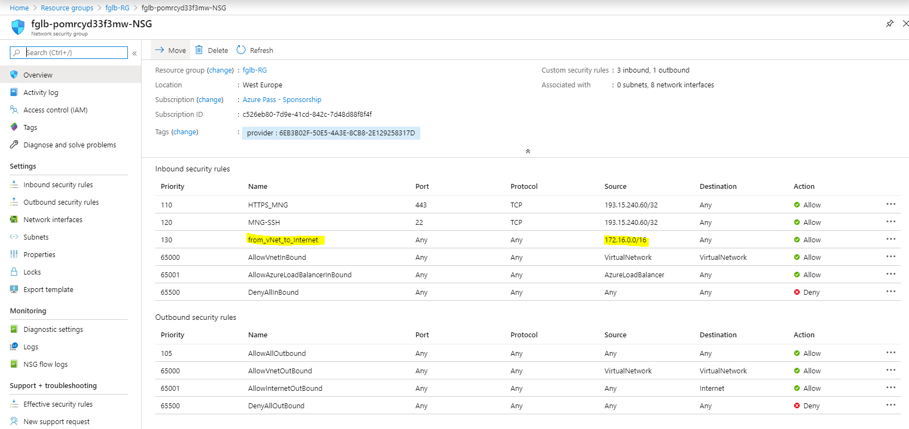

# VNET-Peering from Fortigate Github repository
This is a practical demonstration of the setup presented by Fortinet on the [Github](https://github.com/fortinet/azure-templates/tree/master/FortiGate/VNET-Peering) where the resources are deployed by ARM templates.
There's an alternative way of deploying the same setup by terraform presented in another section of the same Github repository [azure-templates/FortiGate/Terraform/VNET-Peering/](https://github.com/fortinet/azure-templates/tree/master/FortiGate/Terraform/VNET-Peering)

# Description
FortiGate-VM is deployed as HA instance in conjunction with dual Azure Load Balancer to achieve load-balancing of both incoming and outgoing traffic. The internal Azure LB act as a UDR next hop for default route.



# Recovery time
Any manipulation of UDRs or public IP addresses for Active/Passive solutions take 30 seconds to be applied after failover is initiated, whereas Azure LBs can send probes as often as every five seconds and will stop forwarding traffic after two failures. With Azure LBs, a failure is detected and mitigated with six to ten seconds.

# Data path
## Routing to the Internet

The external subnet is not tied with a custom UDR. Traffic to the Internet is routed implicitly to the to the public load balancer to implicit outboud load balancing rules. All traffic egresses to the Internet from the public IP address FGTAPClusterPublicIP 52.236.151.246.

```shell
1 czpene1@Protected-B:~$ curl -s http://whatismyip.akamai.com/
52.236.151.246

```

```shell
130 czpene1@Protected-A:~$ curl -s http://whatismyip.akamai.com/
52.236.151.246
```

When a public load balancer resource is associated with VM instances, each outbound connection source is rewritten. The source is rewritten from the virtual network private IP address space to the frontend Public IP address of the load balancer.
Source: https://docs.microsoft.com/en-us/azure/load-balancer/load-balancer-outbound-connections#snat

The firewall instances are not configured with public IP addresses and can't send traffic to the Internet. As the FortiGate-VMs are used as backend resources in the load balancing rule with a public address all TCP and UDP traffic is forwarded implicitly to LB public address.
However, there's no LB rule for ICMP traffic causing all ICMP not sent out to the Internet. Nevertheless, the ICMP traffic is identified in the session starting logs on the firewall.

```shell
czpene1@Protected-A:~$ ping 8.8.8.8
PING 8.8.8.8 (8.8.8.8) 56(84) bytes of data.
^C
--- 8.8.8.8 ping statistics ---
5 packets transmitted, 0 received, 100% packet loss, time 4086ms

czpene1@Protected-A:~$
```
## Routing between protected subnets

All traffic is directed to internal LB address. As there's the rule lbruleFE2all balancing all traffic on it all traffic including ICMP is forwarded to FortiGate-VM active node.

```shell
czpene1@Protected-A:~$ ping 172.16.138.4
PING 172.16.138.4 (172.16.138.4) 56(84) bytes of data.
64 bytes from 172.16.138.4: icmp_seq=1 ttl=63 time=1.69 ms
64 bytes from 172.16.138.4: icmp_seq=2 ttl=63 time=1.63 ms
^C
--- 172.16.138.4 ping statistics ---
2 packets transmitted, 2 received, 0% packet loss, time 1001ms
rtt min/avg/max/mdev = 1.632/1.665/1.698/0.033 ms
czpene1@Protected-A:~$
```

# Deployment
Except the virtual machines used for testing end to end connectivity and to simulate some traffic all resources are deployed by leveraging Azure RM template through Azure CLI.

## Steps to reproduce

* Open Azure cloud shell
* Clone and execute the scrips

```shell
petr@Azure:~$ cd ~/clouddrive/ && wget -qO- https://github.com/fortinet/azure-templates/archive/master.zip | jar x && cd ~/clouddrive/azure-templates-master/FortiGate/VNET-Peering/ && ./deploy.sh
```

* You'll be prompted to provide the 4 required variables: PREFIX, LOCATION, USERNAME and PASSWORD. For more information take a look at the original documentation on Github. 
* Full output from CLI is in the [vnet-peering-git-provisioning.txt](documents/vnet-peering-git-provisioning.txt) (Note: the subscription ID mentioned in the output is already expired.)

Note: Remember to deploy FortiGate-VM first from the portal otherwise you'll run into an error when deploying azure template directly from CLI without having it deployed the image from marketplace before.

## Testing VMs
Additional VMs can be created from CLI to test connectivity between VNETs.

SUBNETID=$(az network vnet subnet show --resource-group 'fglb-RG' --name ProtectedASubnet --vnet-name 'fglb-VNET' --query id -o tsv)
az vm create --resource-group "fglb-RG" --name "Protected-A" --image "UbuntuLTS" --subnet "$SUBNETID" --admin-username "czpene1" --admin-password "myuser@00123"

SUBNETID=$(az network vnet subnet show --resource-group 'fglb-RG' --name ProtectedBSubnet --vnet-name 'fglb-VNET' --query id -o tsv)
az vm create --resource-group "fglb-RG" --name "Protected-B" --image "UbuntuLTS" --subnet "$SUBNETID" --admin-username "czpene1" --admin-password "myuser@00123"

SUBNETID=$(az network vnet subnet show --resource-group 'fglb-RG' --name SPOKE1Subnet --vnet-name 'fglb-VNET-SPOKE1' --query id -o tsv)
az vm create --resource-group "fglb-RG" --name "Spoke-A" --image "UbuntuLTS" --subnet "$SUBNETID" --admin-username "czpene1" --admin-password "myuser@00123"

SUBNETID=$(az network vnet subnet show --resource-group 'fglb-RG' --name SPOKE2Subnet --vnet-name 'fglb-VNET-SPOKE2' --query id -o tsv)
az vm create --resource-group "fglb-RG" --name "Spoke-B" --image "UbuntuLTS" --subnet "$SUBNETID" --admin-username "czpene1" --admin-password "myuser@00123"

## Corrections
Additional rule had to be added to the NSG to allow FortiGate-VMs to accept traffic sourced from the virtual machines.


